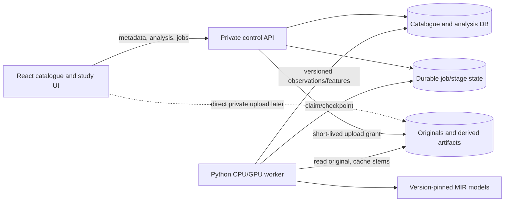
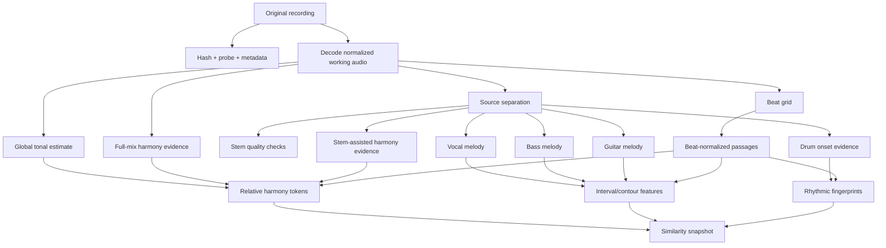

# Audio library architecture and phased implementation plan

Written against: `dc9784e`. Status: proposed architecture; implementation is
blocked intentionally on the offline POC quality gates.

This plan turns the completed product interview into an implementation path.
The exact evaluation tracks are deliberately left open; selecting them is the
first human input required when POC execution begins.

## Outcome

Add a private, single-user library of original studio recordings. Import runs
locally first, analysis may run for hours after the browser closes, and the
result eventually becomes read-only and browsable on an iPad. The product
compares recordings and passages by explainable harmony, melody, and rhythmic
similarity.

The project must prove musical quality before building catalogue screens,
cloud storage, or a production queue.

## Recommended decisions

| Area                         | Recommendation                                                                    | Why                                                                                                                                  |
| ---------------------------- | --------------------------------------------------------------------------------- | ------------------------------------------------------------------------------------------------------------------------------------ |
| First deliverable            | Standalone Python CLI under `research/`                                           | It isolates model quality from browser, API, and deployment work.                                                                    |
| Heavy processing             | Separate Python worker, never React or a Vercel function                          | The models need FFmpeg, CUDA, large weights, durable execution, and process isolation.                                               |
| Browser app                  | Keep the current React/TypeScript app                                             | It remains the study and catalogue UI; no rewrite is justified.                                                                      |
| POC persistence              | Files, manifests, and versioned JSON                                              | This is inspectable, reproducible, and simpler than designing a database before output quality is known.                             |
| Integrated local persistence | SQLite for jobs and catalogue metadata; filesystem for originals and cached stems | One machine and one user do not initially require a distributed queue or object store.                                               |
| Cloud persistence            | PostgreSQL plus a private S3-compatible object store                              | It supports private multi-device reads, durable originals, worker coordination, and future scale without putting audio blobs in SQL. |
| Queue                        | Explicit job/stage rows with leases, attempts, pause flags, and checkpoints       | A restartable stage machine is more appropriate than in-process background tasks.                                                    |
| Analysis contract            | Versioned Pydantic models exported as JSON Schema                                 | The Python producer and TypeScript consumer can share a checked contract.                                                            |
| Source separation            | Bake off a pinned BS-RoFormer six-stem model against `htdemucs_6s`                | Modern quality must be measured; Demucs is a useful historical baseline but its official repository is archived.                     |
| Music analysis               | Compose specialist tools per stage                                                | No credible single model supplies trustworthy stems, key, chords, three melodies, groove, confidence, and explanations.              |
| Similarity                   | Deterministic symbolic features and brute-force comparison first                  | Hundreds or low thousands of tracks do not justify a vector database, and symbolic matches are explainable.                          |
| Remote experience            | Sync metadata and analysis first; do not expose audio playback                    | This satisfies the stated iPad use case while minimizing bandwidth and private-audio exposure.                                       |

The phrase “music theory skill” in the product idea is not a runtime agent
dependency. In production it means deterministic, tested transforms from
model observations into pitch classes, relative chord roots, scale degrees,
interval contours, and harmonic-function evidence. Existing helpers in
`src/utils/musicTheory.ts` are useful vocabulary, but the POC needs equivalent
Python-domain functions so analysis remains reproducible without an LLM.

## Architectural boundaries



### Offline POC shape

The first implementation has only a CLI, an ignored local corpus directory,
and committed schemas/reports:

```text
research/audio-library-poc/
  pyproject.toml
  README.md
  corpus.example.yaml
  schemas/
  src/audio_library_poc/
  tests/
  reports/
  workspace/              # gitignored originals, stems, and run outputs
```

One command validates a corpus manifest; stage commands run independently;
one orchestration command resumes all incomplete stages. Every command writes
machine-readable output and a human-readable report.

### Integrated local shape

The React app talks to a loopback control API. The control process owns local
catalogue metadata, accepts streamed uploads, and records durable jobs. One
separate worker process claims jobs and may outlive the browser tab. The
browser never imports PyTorch, opens arbitrary filesystem paths, or controls a
model process directly.

### Cloud shape

After the POC passes, the same control contract moves to a containerized API,
PostgreSQL, private object storage, and one or more GPU workers. Local and cloud
workers consume the same stage contracts. Cloud browsing cannot ship before
authentication, even for a single-user product; the current globally shared
`api/songs.ts` boundary is explicitly unsuitable.

## Domain model

These terms are drafted here because `CONTEXT.md` already has unrelated local
edits. Merge them into the glossary before production code is added.

### Canonical terms

**Library track**: One imported original studio recording and its editable
catalogue metadata. It is not the existing `Song`/transcription document.
_Avoid_: song, transcription, composition

**Original recording**: The immutable uploaded audio bytes identified by a
content hash. Metadata edits do not mutate or replace those bytes.
_Avoid_: source stem, song file

**Stem artifact**: A regenerable separated audio signal for `vocals`, `drums`,
`bass`, `guitar`, or `other`, produced by one versioned separation stage.
_Avoid_: track

**Analysis run**: One immutable execution manifest and all stage results for a
library track. A rerun creates a new run rather than mutating provenance.
_Avoid_: current analysis

**Canonical analysis**: The completed analysis run currently selected for
browsing, search, and similarity. Selecting a new run does not delete history,
but corrections attached to the old run are not copied automatically.

**Passage**: A beat-bounded region used for comparison and explanation. It is
not an inferred verse, chorus, or other structural section.
_Avoid_: section

**Rhythmic fingerprint**: A derived, beat-normalized onset representation used
for similarity. Domain code should not call this `Groove`, because the existing
glossary reserves **Groove** for the editable drum grid in a structure section.

**Unknown chord**: Audible harmonic evidence exists, but the system does not
accept a chord label at the configured confidence threshold.

**No chord**: The passage is confidently silent or non-harmonic. It is not a
fallback for an uncertain prediction.

### Aggregate ownership

| Aggregate/entity     | Owns                                                                                                    | Important relationships                                                                                |
| -------------------- | ------------------------------------------------------------------------------------------------------- | ------------------------------------------------------------------------------------------------------ |
| `LibraryTrack`       | content hash, original asset reference, editable title/artist/album/year/tags, canonical run id         | Has many analysis runs and belongs to zero or one import batch.                                        |
| `ImportBatch`        | discovered files, per-file import state, totals                                                         | Creates library tracks independently; one bad file does not abort the batch.                           |
| `AnalysisRun`        | pipeline manifest, input hash, timestamps, overall status                                               | Has one `StageRun` per selected capability.                                                            |
| `StageRun`           | stage kind, implementation/model/config versions, attempts, status, metrics, artifact references, error | May be retried or replaced without invalidating successful independent stages.                         |
| `MusicalAnalysis`    | tonal estimate, beat grid, chord regions, melody contours, rhythmic fingerprint                         | Produced from accepted stage outputs for one run.                                                      |
| `AnalysisCorrection` | manual override tied to one analysis run                                                                | Changes the canonical view of that run only; it does not alter raw observations or carry to a new run. |
| `SimilaritySnapshot` | algorithm version, feature versions, pair/component scores, coverage, matched passages                  | Becomes stale when either track changes canonical analysis.                                            |

### Invariants

1. An original recording is addressed by a cryptographic content hash and is
   never overwritten under an existing key.
2. Duplicate bytes may create one library track or be rejected as a duplicate;
   they must never be processed twice accidentally.
3. Only a completed, schema-valid analysis run may become canonical.
4. `unknown` and `no_chord` are different values throughout storage, metrics,
   and UI.
5. Missing or abstained components are not scored as zero. The overall score
   renormalizes over eligible components and exposes component coverage.
6. A stage result records code version, model/checkpoint identifier and hash,
   configuration hash, input artifact hash, and output schema version.
7. Stems and decoded PCM are derived artifacts. Originals, run manifests,
   accepted analysis JSON, corrections, and evaluation reports are durable.
8. Reprocessing never silently changes historical results. It creates a run,
   then explicitly moves the canonical pointer after completion.
9. Theory claims are evidence-bearing: key alternatives and all accepted chord
   or melody observations retain confidence/periodicity or source scores.

## Processing DAG and contracts



Separation and beat tracking can run after decode. Key and full-mix harmony do
not wait for separation. Stem-dependent analyses wait only for their required
stem. A failed guitar stage therefore does not block accepted key, chords,
vocal melody, bass melody, or rhythm.

### Minimum analysis document

The POC should define this as Pydantic models, export validation and
serialization JSON Schemas with `BaseModel.model_json_schema()`, and generate
TypeScript types from the committed schema rather than hand-maintaining two
contracts. Pydantic distinguishes schema generation from instance
serialization in its [JSON Schema documentation](https://docs.pydantic.dev/latest/concepts/json_schema/).

```json
{
  "schema_version": "1.0.0",
  "track_id": "uuid",
  "analysis_run_id": "uuid",
  "source_sha256": "hex",
  "pipeline": {
    "code_revision": "git-sha",
    "stages": {}
  },
  "duration_seconds": 0,
  "tonality": {
    "primary": { "tonic_pc": 0, "mode": "major", "confidence": 0.0 },
    "alternatives": []
  },
  "beats": [{ "time_seconds": 0.0, "index": 0, "confidence": 0.0 }],
  "chords": [
    {
      "start_seconds": 0.0,
      "end_seconds": 0.0,
      "label": "unknown",
      "root_pc": null,
      "quality": null,
      "confidence": 0.0
    }
  ],
  "melodies": {
    "vocals": { "status": "accepted", "coverage": 0.0, "observations": [] },
    "bass": { "status": "accepted", "coverage": 0.0, "observations": [] },
    "guitar": { "status": "abstained", "coverage": 0.0, "observations": [] }
  },
  "rhythmic_fingerprint": {},
  "passages": [],
  "warnings": []
}
```

The real schema must use tagged unions and constrained values; the example
only fixes the conceptual shape. Store both seconds and beat positions where
alignment is known. Exact note onset/duration need not be exposed in the UI,
but observations require internal timing to produce passages and metrics.

### Stage status model

Use a persisted state machine:

```text
queued -> claimed -> running -> succeeded
                    |       -> failed_retryable -> queued
                    |       -> failed_terminal
                    |       -> paused
                    `       -> cancelled
```

Pause and cancellation are cooperative at stage boundaries in the first
version. A lease plus heartbeat returns abandoned `claimed`/`running` work to
the queue after a timeout. Retries create attempts under the same stage run and
must be idempotent by `(stage kind, input hash, implementation version, config
hash)`.

FastAPI's own documentation recommends an external worker mechanism for
[heavy background computation](https://fastapi.tiangolo.com/tutorial/background-tasks/#caveat),
so model inference must not use `BackgroundTasks`. PostgreSQL documents
`FOR UPDATE ... SKIP LOCKED` as suitable for avoiding contention among
consumers of a [queue-like table](https://www.postgresql.org/docs/17/sql-select.html#SQL-FOR-UPDATE-SHARE);
the local SQLite implementation instead claims one row in a short immediate
transaction because only one GPU worker is expected.

## Candidate analysis stack

The detailed source audit belongs in
`research/audio-analysis-pipeline-options.md`. The intended first bake-off is:

| Capability        | First candidates                                                                         | Output consumed by our contract                                                             |
| ----------------- | ---------------------------------------------------------------------------------------- | ------------------------------------------------------------------------------------------- |
| Probe and tags    | `ffprobe` JSON; compare Mutagen only if tag coverage is inadequate                       | codec/duration plus raw ID3-derived title, artist, album, date, genre                       |
| Separation        | pinned BS-RoFormer six-stem checkpoint; `htdemucs_6s` baseline                           | `vocals`, `drums`, `bass`, `guitar`, `other`; piano folds into `other` for the app contract |
| Beat grid         | Beat This! `File2Beats`                                                                  | beat timestamps, optional downbeats, model confidence where available                       |
| Key               | independent HPCP/profile baseline; Essentia `KeyExtractor` as a POC comparison           | all 24 major/minor scores, primary estimate, alternatives, normalized confidence            |
| Chords            | existing madmom floor; ChordMini BTC and ChordNet; Chordino only as a classical baseline | regions simplified to 24 major/minor labels plus `unknown` and `no_chord`                   |
| Vocal F0          | torchcrepe                                                                               | pitch, periodicity/confidence, voiced mask                                                  |
| Bass/guitar notes | Spotify Basic Pitch; compare torchcrepe on clearly monophonic bass                       | timed note events reduced to beat-aligned pitch/interval observations                       |
| Rhythm            | drum-stem onset envelopes plus beat grid using librosa                                   | multi-resolution beat-phase vectors and coverage                                            |
| Evaluation        | `mir_eval`, `museval` where applicable, and custom precision/coverage/retrieval metrics  | one JSON metrics file per candidate/run                                                     |

Do not put an AGPL/GPL component in the production service until its deployment
and distribution implications are reviewed. Essentia, Mutagen, and Chordino
are useful comparison tools but should not become silent architectural
dependencies. Checkpoint terms and hashes are separate from code licences and
must be recorded independently.

## Feature and similarity design

### Harmony

For every accepted chord region, retain the absolute root and quality, then
derive a comparison token relative to the selected tonal centre:

```text
(relative_root_pc 0..11, quality major|minor, diatonic_degree?, function?)
```

Do not force chromatic roots into diatonic Roman numerals. Compare passages
using a blend of duration-weighted token agreement, n-gram overlap, and
sequence alignment. This makes a `I–V–vi–IV` passage similar across keys while
preserving non-diatonic detail.

### Melody

For vocal, bass, and guitar independently:

1. remove unvoiced or below-threshold observations;
2. map pitches to semitone bins;
3. derive adjacent intervals and coarse contour (`down`, `same`, `up`);
4. normalize octave where absolute register is not part of the query;
5. compare beat-aligned interval sequences with subsequence DTW.

The displayed melody score combines only eligible instrument scores and also
shows each source score. Guitar may abstain for chordal/distorted passages.

### Rhythm

Build onset-energy vectors from the drum stem at multiple subdivisions per
beat, including duple and triplet grids. Aggregate those vectors into passages
and compare with cosine/cross-similarity. Normalization uses beat position, not
seconds, so tempo changes do not dominate. This artifact is a
`RhythmicFingerprint`, not the existing editable `GroovePattern`.

### Passage index

Start with overlapping 16- and 32-beat windows. This avoids pretending every
recording is in 4/4 or that reliable verse/chorus segmentation already exists.
For each candidate pair, retain the best non-overlapping passage matches and
their component explanations.

At POC/library scale, calculate pairwise scores directly and cache them by
feature version. A thousand tracks is roughly half a million unordered pairs,
which is manageable for compact symbolic features in offline batches. Add an
approximate-nearest-neighbour index only after measured latency requires it.

### Overall score

Begin with configuration-owned, non-user-editable weights:

```text
harmony 0.40 + melody 0.35 + rhythm 0.25
```

The weights are a hypothesis, not model truth. Renormalize over components that
meet minimum coverage, expose the effective weights and coverage, and mark a
result insufficient when fewer than two components are eligible. Never convert
“not analysed” into `0% similar`.

## POC corpus and evaluation

### Corpus manifest

Audio remains outside Git. Commit only an example manifest and annotations the
user created or is allowed to store. Each real manifest entry records:

- local source path and expected SHA-256;
- title/artist and excerpt boundaries;
- excerpt role: sparse, dense, instrumental/solo, or transition;
- trusted global key and provenance;
- major/minor/no-chord regions with confidence/provenance;
- beat timestamps for evaluated excerpts;
- vocal/bass/guitar reference notes where available;
- manually judged related and unrelated passage pairs.

Exact Led Zeppelin, Pink Floyd, and Radiohead tracks can be selected later.
Track choice should maximize production and arrangement diversity rather than
pick only easy, clean mixes.

### Provisional gates

These thresholds prevent “looks plausible” from becoming the acceptance test.
They may be tightened after the first measured baseline, but lowering one
requires a written explanation.

| Capability        | Gate for the 10-track bake-off                                                                                                                                                                                                                                        |
| ----------------- | --------------------------------------------------------------------------------------------------------------------------------------------------------------------------------------------------------------------------------------------------------------------- |
| Reliability       | All selected stages finish or produce a typed, local failure; an interrupted batch resumes without repeating succeeded stages.                                                                                                                                        |
| Hardware          | No out-of-memory failure on the RTX 2060 6 GB with documented segment/config settings; record peak VRAM, RAM, disk, and real-time factor. End-to-end real-time factor above 8 triggers a deployment/hardware redesign.                                                |
| Metadata          | 100% of files are hashed/probed; tag absence is explicit; inferred fields never overwrite embedded values silently.                                                                                                                                                   |
| Beat              | `mir_eval.beat` F-measure at least 0.90 on annotated excerpts.                                                                                                                                                                                                        |
| Key               | Exact top-1 on at least 8/10 tracks and correct in top-3 on at least 9/10; low-margin cases must have visibly lower confidence.                                                                                                                                       |
| Chords            | Duration-weighted major/minor agreement at least 0.80 overall; accepted-label precision at least 0.90 with at least 0.75 coverage. Report `unknown` and `no_chord` separately.                                                                                        |
| Vocal melody      | Raw pitch accuracy at least 0.85 on accepted frames with at least 0.70 voiced-reference coverage.                                                                                                                                                                     |
| Bass melody       | Same initial target as vocal; report octave errors separately.                                                                                                                                                                                                        |
| Guitar melody     | Exploratory gate: raw pitch accuracy at least 0.65 on lead passages and calibrated abstention on chordal passages. Failure disables this component without blocking the rest.                                                                                         |
| Separation        | A candidate must improve chord precision or relevant melody accuracy versus full-mix input on at least 70% of evaluated excerpts, without unacceptable artifacts in a blinded listening checklist. Public stem metrics are supporting evidence, not the product gate. |
| Invariance        | Pitch-shifted excerpts preserve harmony and melody similarity; time-stretched excerpts preserve rhythm similarity. Each transformed source must rank first against its own original.                                                                                  |
| Passage retrieval | On at least 20 manually labelled queries, a related passage appears in the top five for at least 80%, with no less-related item outranking the exact transformed control.                                                                                             |
| Explainability    | Every ranked result names component scores, coverage, and at least one matched passage; spot checks agree with the stored feature evidence.                                                                                                                           |

Use bootstrap confidence intervals in reports despite the small corpus. A raw
average without per-track/per-passage failures hides exactly the dense-rock
edge cases this POC is meant to expose.

## Phased implementation plan

Each phase is a separate execution context. An implementation agent must read
the named references before editing and must not assume later-phase decisions
have already been made.

### Phase 0 — Documentation and contract discovery

What to produce:

1. Treat `design-plans/audio-library-discovery.md` as the product source and
   this file as the proposed technical source.
2. Read `research/audio-analysis-pipeline-options.md` and re-verify every
   selected project's current README/API before pinning it.
3. Read `CONTEXT.md`, especially the distinction between scale collection and
   tonal centre, no chord data and unclear evidence, and the existing meaning
   of Groove.
4. Read `research/chord-recognition/README.md` and `FINDINGS.md`; preserve the
   old madmom experiment as a baseline, not a template.
5. Produce a short dependency decision table with code licence, checkpoint
   terms, Python/CUDA support, exact API/CLI entry point, output shape, and
   checkpoint SHA-256.

Allowed documented APIs include Pydantic
`BaseModel.model_json_schema()`, Beat This! `File2Beats`,
`torchcrepe.predict(..., return_periodicity=True)`, Basic Pitch
`basic_pitch.inference.predict`, librosa `onset.onset_strength`,
`segment.cross_similarity`, and `sequence.dtw(..., subseq=True)`. Confirm these
against the linked primary sources before use.

Verification:

- Every dependency row links to an official repository, paper, or reference.
- Every checkpoint has a recorded source, licence/terms, and hash.
- Unknown licensing or unavailable checkpoints stop that candidate only.

Anti-pattern guards:

- Do not copy a secondary blog's invocation.
- Do not resurrect patched madmom as the only chord candidate.
- Do not infer a licence for model weights from the source-code licence.

### Phase 1 — Reproducible POC harness and metadata

What to implement:

1. Create `research/audio-library-poc/` with a locked Python 3.11 environment,
   CLI entry point, structured logs, and ignored workspace.
2. Define Pydantic models for the corpus manifest, pipeline manifest, stage
   result envelope, artifact reference, error, and metrics.
3. Export validation and serialization schemas with the documented
   `model_json_schema(mode=...)` API.
4. Implement SHA-256 streaming, `ffprobe` JSON capture, embedded-tag mapping,
   filename fallback, duplicate detection, and atomic JSON writes.
5. Add a fake deterministic stage so resume, retry, pause, cancellation, and
   cache-key behavior can be tested without model weights.

Documentation references:

- Pydantic JSON Schema documentation linked above.
- FFmpeg/ffprobe documentation selected in Phase 0.
- Repository research convention in `research/chord-recognition/README.md`.

Verification:

- Unit tests cover valid/invalid manifests, duplicate hashes, absent tags,
  atomic replacement, interrupted writes, cache hits, and version mismatch.
- A three-file smoke manifest produces stable byte-for-byte JSON after path
  normalization.
- No copyrighted audio or absolute user path is committed.

Anti-pattern guards:

- Do not add React, FastAPI, cloud storage, or a database.
- Do not key artifacts by filename.
- Do not keep decoded WAV when a stage has completed.

### Phase 2 — Separation bake-off

What to implement:

1. Copy only the documented inference pattern for one pinned BS-RoFormer
   six-stem checkpoint and for Demucs `htdemucs_6s`.
2. Adapt both behind one `Separator` protocol returning the five app stem
   kinds plus candidate-native artifacts and metrics.
3. Make segment length, overlap, shifts, device, and precision explicit config;
   record effective values in the stage result.
4. Validate outputs for duration, sample rate, channels, finite samples, and
   mixture reconstruction error before downstream use.
5. Benchmark the excerpt corpus, then full tracks for the winning candidate.

Documentation references:

- Official Demucs README and current separator sources captured in
  `research/audio-analysis-pipeline-options.md`.
- MUSDB18 and `museval` official docs for supporting four-stem sanity checks.

Verification:

- Both candidates run on the RTX 2060 without OOM using committed configs.
- Reports compare runtime, peak VRAM, disk, listening checklist, reconstruction
  error, and downstream-ready output.
- A process kill followed by resume does not accept partial stem files.

Anti-pattern guards:

- Do not select by published SDR alone.
- Do not assume a six-stem output maps piano into guitar; map piano to `other`.
- Do not download an unpinned checkpoint at every run.

### Phase 3 — Beat, key, and chord analysis

What to implement:

1. Copy Beat This!'s documented `File2Beats` inference pattern without its
   optional madmom DBN.
2. Implement one transparent HPCP/profile key baseline that retains scores for
   all 24 major/minor candidates; compare with Essentia only in the POC.
3. Run the old madmom baseline, ChordMini BTC, and ChordMini ChordNet against
   full mix and selected stem combinations.
4. Normalize candidate vocabularies to major/minor/no-chord, then calibrate an
   explicit threshold that emits `unknown` below confidence.
5. Align accepted chord regions to seconds and beat positions; derive relative
   roots and optional degree/function evidence without forcing chromatic notes.

Documentation references:

- `CONTEXT.md` scale-collection and tonal-centre definitions.
- Existing exact repo theory helpers in `src/utils/musicTheory.ts:24-70` and
  harmonic fields in `src/constants/harmonicFields.ts`.
- Candidate APIs and `mir_eval.chord` references in the research report.

Verification:

- Beat, key top-k, chord agreement, accepted precision, coverage, and
  reliability diagrams are reported per excerpt and track.
- Transposed audio metamorphic tests preserve relative harmony tokens.
- `unknown` and `no_chord` each have test fixtures and distinct metric counts.

Anti-pattern guards:

- Do not call the most frequent chord a proven tonic.
- Do not hide uncertainty by carrying the prior chord forward.
- Do not expand to sevenths/modes until major/minor gates pass.

### Phase 4 — Instrument-specific melody contours

What to implement:

1. Copy torchcrepe's documented pitch-plus-periodicity invocation for vocal
   and monophonic-bass experiments.
2. Copy Basic Pitch's documented `predict` API for bass and guitar stems.
3. Normalize both into one observation contract with source, pitch, confidence,
   voiced state, seconds, and beat position.
4. Calibrate separate thresholds for vocals, bass, and guitar; derive interval
   and contour features only from accepted observations.
5. Measure full-mix versus separated-stem inputs and lead versus chordal guitar
   passages.

Documentation references:

- torchcrepe and Basic Pitch official repositories cited in the research
  report.
- `mir_eval.melody` raw pitch/raw chroma/voicing metrics.

Verification:

- Report accuracy and coverage independently per source.
- Pitch-shift and octave-shift fixtures preserve interval/contour similarity.
- Chordal guitar causes abstention rather than a fabricated lead line.

Anti-pattern guards:

- Do not merge instrument observations before scoring them.
- Do not interpret Basic Pitch MIDI as guaranteed musical truth.
- Do not let guitar failure block the run's successful components.

### Phase 5 — Rhythmic fingerprints and passage similarity

What to implement:

1. Copy librosa's documented onset-strength, cross-similarity, and subsequence
   DTW patterns identified in Phase 0.
2. Build multi-resolution, beat-normalized rhythmic fingerprints from drums.
3. Build overlapping 16/32-beat harmony, melody, and rhythm passages.
4. Implement pure, deterministic component scorers and the fixed weighted
   aggregation with minimum-coverage rules.
5. Cache pair results by both canonical run ids, feature versions, algorithm
   version, and weight config hash.
6. Emit explanations containing matched ranges, tokens/contours/fingerprint
   evidence, component scores, effective weights, and coverage.

Documentation references:

- librosa APIs and DTW example links in the research report.
- Existing pure-domain style in `src/domain/` and Vitest colocated tests; do
  not copy TypeScript into Python, but preserve the pure-core pattern.

Verification:

- Symmetry, identity, bounds, missing-component, and deterministic-order tests
  pass.
- Invariance and manually judged retrieval gates are reported.
- A 1,000-track synthetic feature corpus establishes pairwise runtime and
  memory without using synthetic audio as a model-accuracy benchmark.

Anti-pattern guards:

- Do not add embeddings or a vector database before measuring this baseline.
- Do not compare rhythms in wall-clock seconds.
- Do not report an overall score when fewer than two components qualify.

### Phase 6 — Full-track POC decision

What to implement:

1. Freeze the best config from Phases 2–5 and process three to five full tracks
   unattended.
2. Exercise silence, intros, transitions, dense mixes, long solos, tempo drift,
   cancellation, restart, and selective stage reprocessing.
3. Produce one decision report: measured gates, per-track failures, storage,
   runtime, GPU profile, licences, and the exact accepted/disabled components.
4. Classify each capability `go`, `conditional`, or `no-go`; do not average
   failures into one blanket result.

Verification:

- Every number links to a run manifest and source annotation.
- A clean machine can reproduce one accepted run from lockfiles and cached or
  documented checkpoints.
- The report names the production models/configs or explicitly recommends
  stopping before product integration.

Anti-pattern guards:

- Do not start the catalogue UI merely because the pipeline executes.
- Do not change thresholds after seeing failures without preserving both
  reports and stating why.

### Phase 7 — Production contract and private storage foundation

Prerequisite: core POC capabilities are `go` and an authentication approach is
selected.

What to implement:

1. Merge the canonical audio-library terms into `CONTEXT.md` without changing
   the existing Song, structure, or Groove meanings.
2. Record accepted architectural decisions as ADRs.
3. Build a Python control API around the accepted Pydantic contracts and export
   OpenAPI/JSON Schema for a generated TypeScript client.
4. Implement `LibraryTrack`, original asset, immutable analysis run, stage run,
   correction, and canonical-pointer persistence.
5. Implement a `BlobStore` interface with local filesystem and private
   S3-compatible adapters. Direct browser upload should use short-lived,
   authenticated presigned grants; AWS documents this pattern for
   [uploading objects without giving the client storage credentials](https://docs.aws.amazon.com/AmazonS3/latest/userguide/PresignedUrlUploadObject.html).
6. Stream local uploads. FastAPI documents `UploadFile` as a spooled file suited
   to [large binary uploads](https://fastapi.tiangolo.com/tutorial/request-files/#uploadfile);
   never read an entire MP3 into request memory.

Repository references:

- Existing `Song` begins at `src/types/index.ts:34`; do not extend it.
- Browser SQLite creation starts at `src/services/db.ts:91`, and the existing
  song table at `src/services/db.ts:118`; neither becomes the authoritative
  binary/analysis store.
- Existing saved-library facade starts at
  `src/services/savedLibrary.ts:108`; the new API client should expose a
  parallel audio-library service rather than overload it.

Verification:

- Contract tests validate Python responses against committed schemas and the
  generated TypeScript client.
- Integration tests cover duplicate upload, interrupted upload, wrong hash,
  private access, immutable object keys, canonical pointer transaction, and
  deleting cache without deleting the original.
- Threat-model checklist confirms private bucket/container, scoped upload
  grant, file-size limits, probe validation, and no path traversal.

Anti-pattern guards:

- Do not store audio blobs in sql.js/IndexedDB or PostgreSQL.
- Do not expose a public bucket or unauthenticated listing endpoint.
- Do not reuse the current global `api/songs.ts` behavior.

### Phase 8 — Durable local/cloud worker

What to implement:

1. Port the accepted POC stages unchanged behind production job adapters.
2. Add job/stage tables, deterministic priorities, leases, heartbeats,
   cooperative pause/cancel, bounded retries, and per-stage logs.
3. Implement local SQLite claiming for one worker and PostgreSQL claiming using
   a short transaction and documented `SKIP LOCKED` for cloud workers.
4. Add capacity policy: remove decoded PCM first, then least-recently-used stem
   caches; never evict originals or accepted analysis.
5. Add manual selective/batch reprocessing and outdated-stage calculation from
   version manifests.

Verification:

- Crash/kill tests at every stage boundary resume safely.
- Two cloud workers cannot process the same claimed attempt.
- Pause, resume, retry, cancel, priority, and overnight batches have integration
  tests.
- Disk pressure cannot evict a permanent artifact.

Anti-pattern guards:

- Do not use FastAPI `BackgroundTasks` for inference.
- Do not acknowledge a stage before outputs are atomically durable and valid.
- Do not make one failed capability fail unrelated successful outputs.

### Phase 9 — Catalogue, analysis, and similarity UI

What to implement:

1. Add a seventh app module through the existing conditional module seam at
   `src/App.tsx:29-34`, with pt-BR catalogue copy.
2. Create a dedicated `audioLibrary` domain/service/hook/component slice; keep
   server state out of the monolithic Zustand document-editing state where
   possible.
3. Implement batch import, metadata correction, artist/album and flat views,
   tags, processing status, retry controls, and storage indicators.
4. Implement track detail with key/alternatives, chord timeline, source melody
   contours, confidence/unknowns, similar-track ranking, component breakdown,
   and matched passages.
5. Implement metadata and theory filters over server-provided query fields.

Repository references:

- Follow the current module seam in `src/App.tsx:16-34`.
- Follow pure-domain patterns under `src/domain/`, service boundaries under
  `src/services/`, and hooks such as `src/hooks/useCollection.ts`.
- User-visible text remains Brazilian Portuguese and design tokens belong in
  `src/styles/globals.css`.

Verification:

- Vitest covers domain selectors, score/coverage presentation, status
  transitions, and stale-analysis indicators.
- `npm test` and `npm run build` pass.
- Manual tablet-width checks cover catalogue, track detail, and matched
  passages; unknown and missing values remain visible rather than misleading.

Anti-pattern guards:

- Do not generate or mutate a transcription document from analysis.
- Do not label the rhythmic fingerprint as the existing editable Groove in
  TypeScript.
- Do not imply confidence by color alone.

### Phase 10 — Authenticated iPad browsing and sync

What to implement:

1. Add the selected single-user authentication boundary before exposing any
   cloud route.
2. Sync originals privately if cloud durability/cloud workers are enabled;
   otherwise sync only catalogue metadata, canonical analysis, corrections,
   and similarity snapshots.
3. Make the iPad route read-only initially and omit audio/stem download URLs.
4. Add cache headers/ETags for immutable run documents and canonical-pointer
   invalidation for fresh reads.
5. Test local processing followed by cloud publication as a resumable,
   idempotent operation.

Repository references:

- Existing `src/services/sync.ts:67-124` and `:164` demonstrate current sync
  entry points but silently swallow failures and use global song pulls; copy no
  security or failure semantics from them.
- Existing `api/songs.ts` accepts `device_id` but is not authentication.

Verification:

- An unauthenticated client cannot list tracks, metadata, analyses, jobs, or
  objects.
- A processed local run appears on iPad after publication without exposing
  original/stem audio.
- Revoked sessions and expired upload grants fail closed.

Anti-pattern guards:

- Do not treat a device id as identity.
- Do not ship “temporary” public URLs or buckets.
- Do not promise offline iPad support in this phase.

### Phase 11 — Optional cloud processing and enhancements

Only after local usage reveals a need:

- add a cloud GPU worker using the same job and artifact contracts;
- require manual approval and estimated cost before paid analysis;
- add fingerprint metadata enrichment;
- add modes, pentatonic/blues scales, richer chords, sections/time signatures,
  user-tunable weights, audio playback, and vector indexing independently;
- carry corrections forward only through an explicit review/migration flow.

Each enhancement needs its own metric and must preserve old run readability.

## Final verification checklist

- Product decisions in `audio-library-discovery.md` map to a phase or explicit
  deferral.
- Dependency invocations match current primary documentation; no invented
  method or undocumented argument remains.
- POC gates are measured on real, trusted excerpts and transformed-real-audio
  invariance tests, not synthetic-tone accuracy tests.
- All contracts are versioned and provenance includes input/config/model hashes.
- Originals and accepted analyses survive cache cleanup and worker crashes.
- `LibraryTrack` remains distinct from the existing `Song` transcription type.
- `RhythmicFingerprint` remains distinct from the existing editable `Groove`.
- Cloud access is private and authenticated before iPad browsing ships.
- Tests and build commands from `AGENTS.md` pass in every app-integrating phase.

## Decisions intentionally left until evidence exists

- The exact ten recordings and excerpt boundaries.
- Winning separator, chord recognizer, key detector, and melody thresholds.
- Whether cloud stores originals immediately or only when cloud processing is
  enabled.
- Authentication, PostgreSQL host, and S3-compatible provider.
- Whether the guitar melody component earns a production launch.
- Whether pairwise search ever needs embeddings or an ANN/vector index.
- Final score weights after retrieval judgments.

None of these blocks writing the POC harness. Track selection is the only
missing input before running model-quality experiments.
