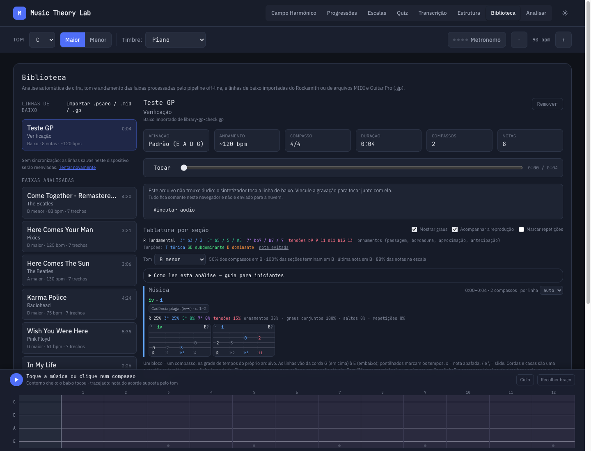

# Biblioteca imports

Biblioteca accepts Rocksmith 2014 `.psarc`, MIDI `.mid`/`.midi`, and Guitar
Pro 7/8 `.gp` files. GP6 `.gpx` and older `.gp3`/`.gp4`/`.gp5` formats are
not accepted by this flow.

Guitar Pro scores are parsed with alphaTab and exported internally to MIDI
in playback order, including repeats, alternate endings, ties, and tempo
changes. The existing MIDI bass-channel selector and arrangement adapter
then build the same `BassChart` used by MIDI and Rocksmith. Degrees, key
suggestions, harmonic functions, cadence analysis, tabs, the fretboard and
sampled-bass playback all consume that chart. Bass notes on Guitar Pro's
secondary bend channel stay with their primary track.

The adapter suggests four-string bass fingering, as it does for MIDI; it
does not preserve Guitar Pro's original strings, frets or all articulations.
Only the bass part feeds these analyses. The file's other instrument parts
are not additional harmony evidence.

## Persistence

Derived charts synchronize to the existing Turso database through
`/api/bass-charts`, using the same shared single-user library model as
transcriptions and Library annotations. The route creates its table on first
use with the deployment's existing `TURSO_DATABASE_URL` and
`TURSO_AUTH_TOKEN`; no extra credentials or manual migration are required.

The browser keeps charts in IndexedDB and uploads titles, artists, album,
source filename, tuning, timing, sections and bass notes. Original imported
files and extracted or attached recordings are not uploaded. On another
device the chart can play through the existing sampled bass without its
recording. View preferences and manually chosen analysis keys remain local.

Existing browser imports migrate into the sync journal on first use. Sync
runs when Biblioteca opens, after importing or deleting, on focus or
reconnection, and every 30 seconds while Biblioteca is visible. Failed
requests retain local data for retry and show the unsynchronized status.
Timestamped deletion records prevent an offline device from restoring a
removed chart. Server and client validate charts before applying them.

## Verification

Run `npm test` and `npm run build`. Focused checks:

```sh
npx vitest run src/services/gp/importGpChart.test.ts src/services/bassChartSync.test.ts api/bass-charts.test.ts
```

Import a `.gp` in Biblioteca, enable “Mostrar graus” and play the chart.
Check that it remains available after reloading and appears on a second
device after deployment. A linked recording is local to its device.


